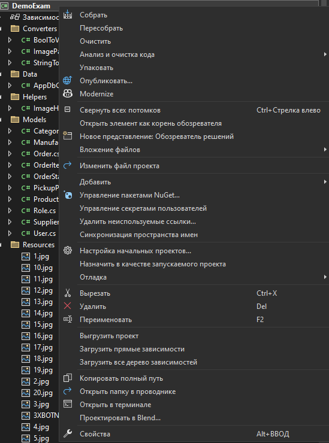

ПРЕЖДЕ ЧЕМ НАЧАТЬ ПРОВЕРЬ РАБОТОСПОСОБНОСТЬ ПРИЛОЖЕНИЯ

1. ЗАЙДИ В ПАПКУ С ПРОЕКТОМ И ОТКРОЙ ФАЙЛ DEMOEXAM.CSPROJ (открыть с помощью->Visual Sudio Code 2022 (c этим внимательно))
2. Попросит восстановить пакеты NuGet (попробу сначала наверху окна найти Сборка -> Очистить решение -> Пересобрать решение -> Собрать решение) ИЛИ попробуй dotnet clean->dotnet restore (эти комангды вводишь в терминал, терминал открывается так:         
(правой кнопкой мыши по DemoExam(справа должно быть окно Обозревателя Решений)->И ищешь пункт ОТКРЫТЬ В ТЕРМИНАЛЕ))
3. Если проект собрался можешь либо настраивать подключение к БД в файле AppDbContext.cs, либо идешь заполнять БД (КАК УЧИЛ)
4. Когда будешь собираться все лить в репозиторий, 1-е не забудь про все диаграммы, схемы, скрины и тд, 2-е уточни у экспертов нужна ли develop-ветка в репозиторий или можно лить в мастер

команды гитБаш (гит)   
cd - перемещение по папкам (сохраняй на рабочий стол свой проект), тогда будет так - cd Desktop->cd НАЗВАНИЕ_ТВОЕГО_ПРОЕКТА     
git init - инициализация локального хрнилища       
git remote add origin твоя_ссылка_на_гит     
git add .      
git commit -m "ТВОи_ПОСЯНЕНИЯ"      
git push (если будет ошибка, должна быть подсказка с длинной строкой гит пуша)     

если эксперты будут говорить про вторую ветку ГИТА, то прежде чем писать команды, начиная от git add ., пишешь:  
git checkout -b develop (создаешь и сразу же переключаешься на новую ветку)